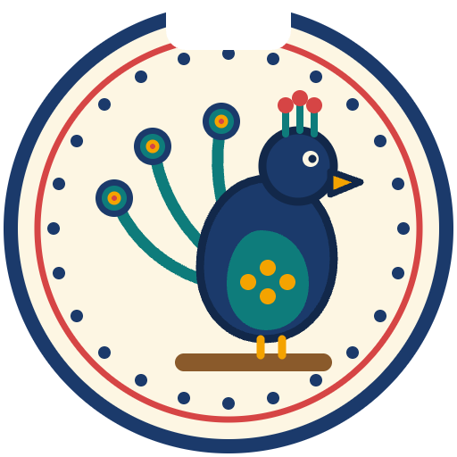
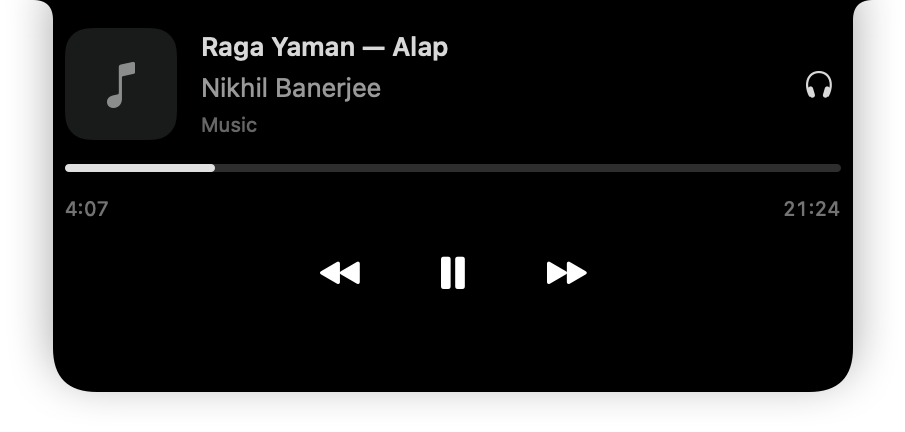
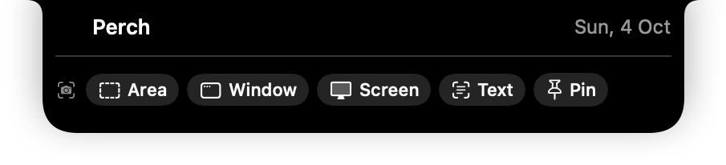
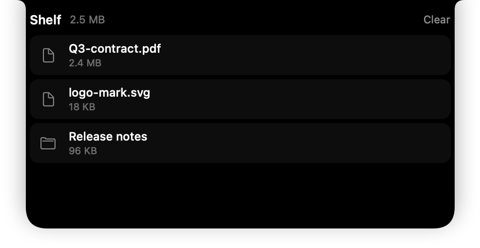
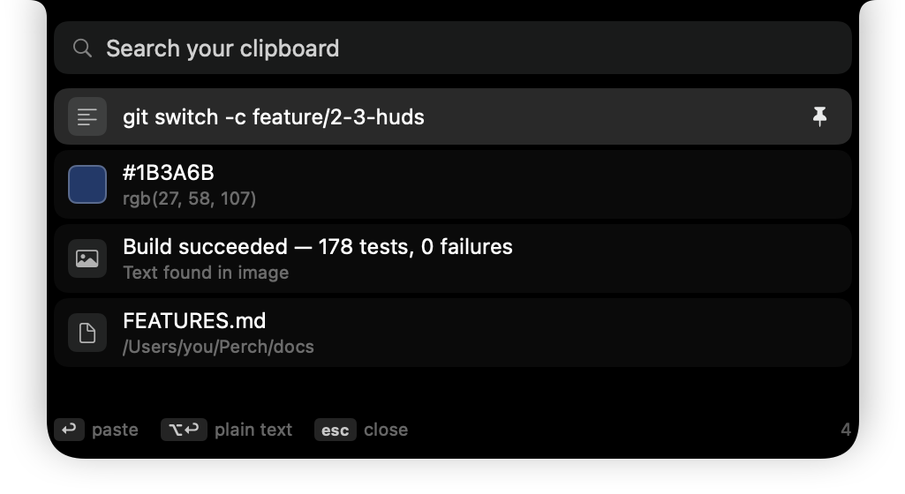
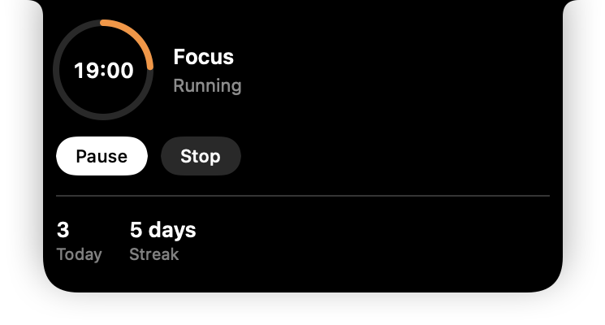
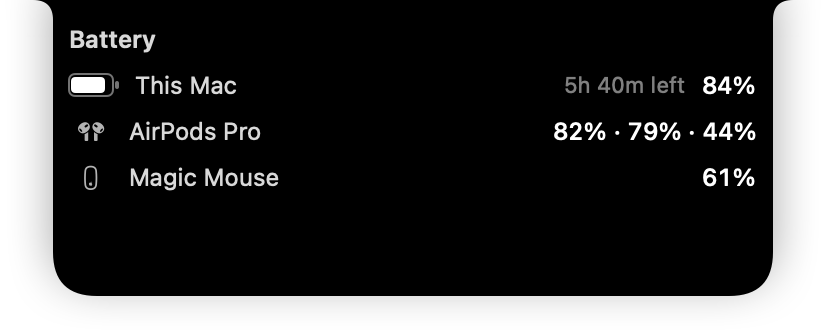
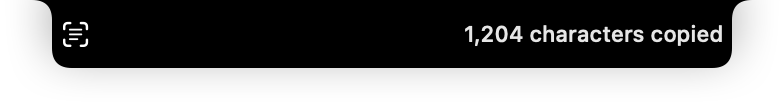

<h1 align="center">
  <br>
  
  <br>
  Perch
  <br>
</h1>

<p align="center"><b>Your MacBook notch, put to work. Free forever, open source.</b></p>

<p align="center">
  <a href="https://github.com/Milanpatel35/Perch/actions/workflows/ci.yml"></a>
  <a href="LICENSE"></a>
  
  
  <a href="https://github.com/Milanpatel35/Perch/releases"></a>
</p>

Say hello to **Perch** — the black cutout at the top of your MacBook becomes a
live surface, the way the Dynamic Island works on an iPhone. Music with
artwork and scrubbing, a shelf you drag files onto, clipboard history, your
next meeting with a join button, a focus timer, battery for every accessory,
a system monitor, your camera, screenshots — each one a switch you can turn
off, and each one costing nothing when it is off.

No Pro tier, no licence key, no account, no telemetry. On a Mac without a
notch it draws a floating island instead.

<p align="center">
  
</p>

<p align="center">
  <a href="https://milanpatel35.github.io/Perch/"><b>Website — try the island in your browser</b></a> ·
  <a href="#installation">Install</a> ·
  <a href="#what-it-does">Features</a> ·
  <a href="#how-it-compares">Compare</a> ·
  <a href="docs/PLAN.md">Roadmap</a> ·
  <a href="CONTRIBUTING.md">Contribute</a>
</p>

---

## Installation

**System requirements**

- macOS **13 Ventura** or later
- Apple Silicon or Intel Mac — one universal app

### Option 1: download the app

<a href="https://github.com/Milanpatel35/Perch/releases/download/build-0.13.0/Perch-0.13.0-unsigned.zip"></a>

1. Unzip it and **drag Perch into Applications.** Run straight from
   Downloads, macOS starts a temporary copy and Perch cannot open at login.
2. Open it. The first time, macOS will stop it — see below.
3. A short welcome asks which modules you want. Nothing asks for a
   permission until you switch on a module that needs one.

> [!IMPORTANT]
> These builds are **not signed or notarised yet** — that arrives with a
> Developer ID certificate (#25). macOS will say it cannot check Perch for
> malicious software. You only get past this once.

**macOS 15 Sequoia and later:** try to open Perch, press **Done**, then go to
**System Settings → Privacy & Security**, scroll down and press **Open
Anyway** next to Perch.

**macOS 13 and 14:** right-click Perch in Applications → **Open**, and
confirm.

Or, on any version, from Terminal:

```bash
xattr -dr com.apple.quarantine /Applications/Perch.app
```

### Updating

From 0.13.0, Perch updates itself: **menu bar icon → Check for Updates…**,
or **Settings ▸ About**, shows whether you are up to date and installs a new
build with its notes. It checks once a day on its own, and you can switch
that off in the same place. Every update is signed, and one that does not
match the signature is refused. Copies older than 0.13.0 need this one
downloaded by hand, once.

Your settings carry over from one build to the next.
[Every build](https://github.com/Milanpatel35/Perch/releases) is listed with
what changed and what was checked before it was published.

### Option 2: build from source

```bash
git clone https://github.com/Milanpatel35/Perch.git
cd Perch
brew install xcodegen
make bootstrap
make run
```

Xcode 16 or later. `make test` runs the suite; `make site` serves the website
on <http://localhost:8000>.

### Homebrew

`brew install --cask perch` goes live with the first signed release.

---

## Getting started

| | |
|---|---|
| **Hover** the notch | The island opens. Move away and it closes |
| **Click** it | Keeps it open while you use it; click again to close |
| **Drag a file** onto it | The shelf catches it |
| **Menu bar icon → Settings…** | Switch modules on and off, one by one |

<p align="center">
  
  <br><sub>The home surface — what hovering the notch shows, with a row for each module that has one.</sub>
</p>

---

## What it does

Thirteen of the eighteen modules are **live** in the build you can download.
Every picture below is rendered from the app's own views by `make
screenshots` — not a mockup.

<table>
  <tr>
    <td align="center" width="50%"><br><b>Shelf</b><br><sub>Drag files up, drop them anywhere</sub></td>
    <td align="center" width="50%"><br><b>Clipboard</b><br><sub>Searchable history, pinning, OCR on images</sub></td>
  </tr>
  <tr>
    <td align="center"><br><b>Focus timer</b><br><sub>Counts down in the notch; survives the lid closing</sub></td>
    <td align="center"><br><b>Battery</b><br><sub>The Mac and every accessory, in one list</sub></td>
  </tr>
  <tr>
    <td align="center"><br><b>Screenshots</b><br><sub>Area, window, screen — or copy the text in an area</sub></td>
    <td align="center"><br><b>HUDs</b><br><sub>Volume and brightness, in the notch</sub></td>
  </tr>
</table>

| Module | What it does | Status |
|---|---|---|
| **Now Playing** | Apple Music and Spotify: artwork, scrubbing, AirPlay target, swipe to skip, a peek on track change. Not browser audio — macOS closed that to other apps | ✅ Live |
| **Shelf** | Drag files to the notch, hold them, drop them anywhere else. AirDrop and quick format conversion built in | ✅ Live |
| **Clipboard** | Searchable history with pinning — text, images, colours — and the text read out of anything you screenshot | ✅ Live |
| **Focus** | Pomodoro that counts down in the notch, survives the lid being closed, and keeps listed apps and sites out of the way while you work | ✅ Live |
| **Calendar** | Next meeting, countdown, one-click join for six services — then mute, camera and leave without finding the window (Zoom verified) | ✅ Live |
| **HUDs** | Volume, brightness, charging, Bluetooth, Focus and the camera-in-use dot, with the macOS overlay suspended while it is on | ✅ Live |
| **Battery** | Mac, AirPods, mouse, keyboard, trackpad — and one low warning per discharge, not one per wobble | ✅ Live |
| **Notifications** | Mirrored into the island, with inline reply | ✅ Live |
| **Camera** | Live preview under the notch; opens itself before a meeting; pin it while presenting | ✅ Live |
| **System stats** | CPU, GPU, memory, disk, network and fans — with alert thresholds | ✅ Live |
| **Shortcuts** | Favourite Shortcuts as island buttons; Perch actions in the Shortcuts app; `perch://` and a `perch notify` CLI | ✅ Live |
| **Screenshots** | An area, a window or the screen, into the shelf. Copy the text in an area on-device, or pin one above everything | ✅ Live |
| **Hide the notch** | Black out the menu bar — or fill it from your wallpaper — per display, plus an island that stays invisible until something happens | ✅ Live |
| **No-notch mode** | A floating island for Mac mini, Studio, iMac and external displays | ✅ Live |
| **Weather** | Conditions and hourly forecast, off by default | 🔜 Coming soon |
| **Windows** | Snap and tile by dragging a window to the notch | 🔜 Coming soon |
| **Notes** | A scratchpad pinned to the island | 🔜 Coming soon |
| **Voice to text** | On-device dictation | 🔜 Coming soon |

Two of them exist nowhere else: **nobody in the field has a system monitor**,
and nobody has built the camera out past a plain mirror. The whole
specification, module by module, is [docs/FEATURES.md](docs/FEATURES.md).

> [!NOTE]
> The Calendar's call controls drive Zoom's menu bar and are verified there;
> Teams and Webex are best effort, and Meet, Around and Whereby have none — a
> browser tab has no menu bar to drive. Notifications are read from the
> banner through Accessibility, never from the notification database: Perch
> does not ask for Full Disk Access and never will.

---

## How it compares

Prices checked September 2026 — confirm on each vendor's own site before
buying, since they change faster than READMEs do.

**Perch's column is 1.0, not today's build.** Thirteen of the eighteen modules are
built; the rest are marked Coming soon in the table above. Every
rival's column is what that app does today.

| | Perch | Boring Notch | Seam | Alcove | NotchNook | DynamicLake Pro | NotchBay | TopNotch |
|---|---|---|---|---|---|---|---|---|
| Price | **Free** | Free | $19.90 | ~$15–17 | $25 / $3 mo | $13.99 | $9 | Free |
| Open source | **Yes** | Yes | No | No | No | No | No | No |
| Minimum macOS | **13** | 13 | 14 | 14 | 14 | 13/14 | 14 | 12 |
| Media controls | Yes | Yes | Yes | Yes | Yes | Yes | Yes | — |
| File shelf | Yes | Basic | Yes | — | Yes | Yes | Yes | — |
| Clipboard history | Yes | — | — | — | — | Partial | 60 clips | — |
| Focus timer | Yes | — | Yes | — | — | — | Yes | — |
| Calendar / meeting join | Yes | — | Yes | — | Peek | Activities | Yes | — |
| In-call mute / camera / leave | Yes | — | — | — | — | — | Yes | — |
| System HUD replacement | Yes | — | Yes | Yes | Yes | Yes | Yes | — |
| **System stats** | **Yes** | — | — | — | — | — | — | — |
| **Camera beyond a mirror** | **Yes** | — | — | — | — | — | — | — |
| Window snapping | Yes | — | — | — | — | Yes | — | — |
| Works without a notch | Yes | Yes | Yes | — | — | Partial | — | n/a |
| Hides the notch instead | Yes | — | — | — | — | — | — | Yes |

Full write-up with sources: [docs/COMPARISON.md](docs/COMPARISON.md).

TopNotch is in the table for completeness but solves the opposite problem — it
hides the notch by blacking out the menu bar, rather than using it.

## Privacy

Perch makes no network requests except to the Sparkle appcast when checking for
updates. Clipboard history, file shelf contents, camera frames and calendar
data never leave your Mac and are stored in the app's own container. There is
no analytics SDK, no crash reporter phoning home, and no account.

Two optional features can make a request, both **off by default** and both
disclosed where you turn them on: the weather forecast, and the public-IP
readout inside System stats. Nothing else is ever allowed to, and adding a
third requires a documented decision record, not just a pull request.

The camera specifically: no frame is written to disk unless you press the
snapshot button, no buffer is kept after the island closes, and the device is
released — green light off — within half a second of collapsing. Those are
tests in the suite, not intentions.

Permissions are requested lazily — Calendar access is only asked for when you
switch the Calendar module on, camera access only when you switch the Camera
module on, and never at launch.

## Contributing

Contributions are very welcome, especially bug reports from unusual display
setups. Start with [CONTRIBUTING.md](CONTRIBUTING.md), then look for issues
tagged `good first issue`.

If you are using an AI coding agent, point it at [CLAUDE.md](CLAUDE.md) first.

## Licence

MIT — see [LICENSE](LICENSE).

Perch is not affiliated with or endorsed by Apple Inc. "Dynamic Island" is a
trademark of Apple Inc., used here only to describe what the app resembles.
